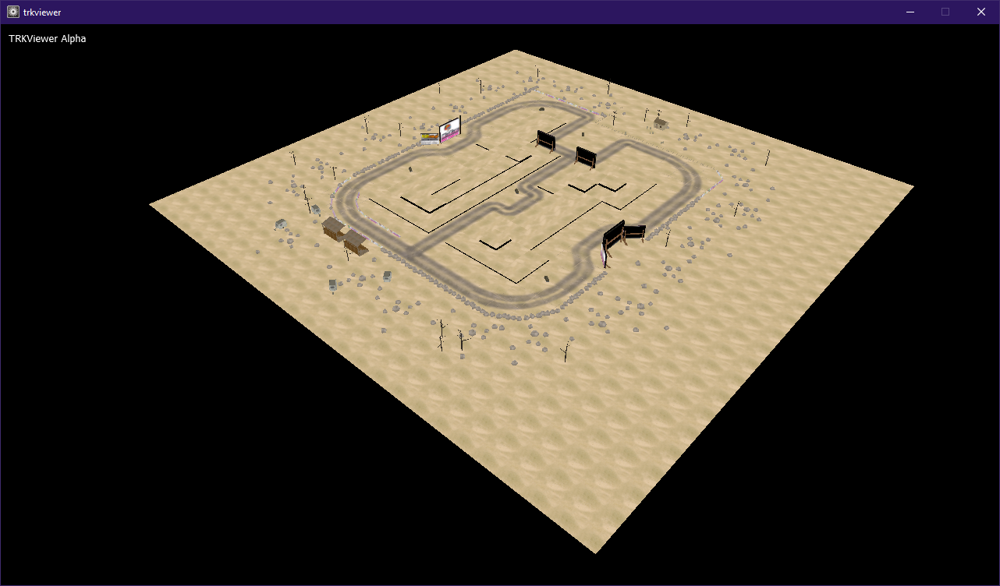

# trkviewer
 Track (.trk) viewer for PolEngine games.

**This program is powered by abandoned Xors3D engine**.

You can find required DLLs here: 

https://github.com/Guevara-chan/Xors3D-for-PB/tree/master/DLL

## What is supported?
- Map blocks
- Models
- Texture orientation
- Block height

## What is not supported?
- Sprites
- Slopes and angled blocks

# Building
You can download trial version of the engine from
https://drive.google.com/file/d/0BzkXGILTmN3JS1ZkTjBzdHo5UHc/view

Link headers and lib file to project and you should be good to go.

#

